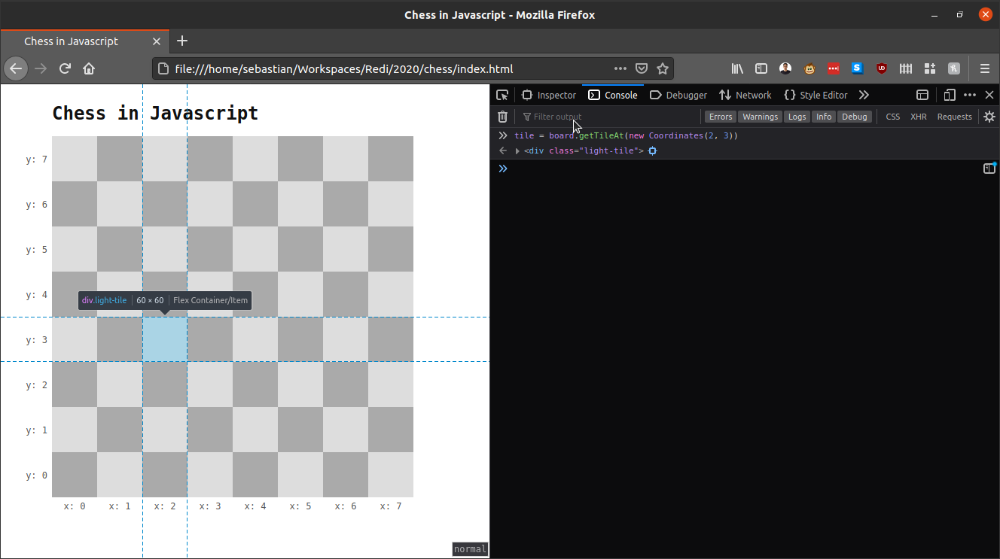
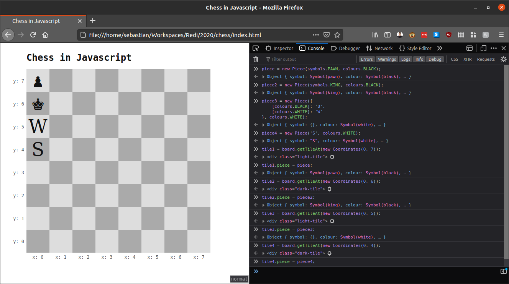
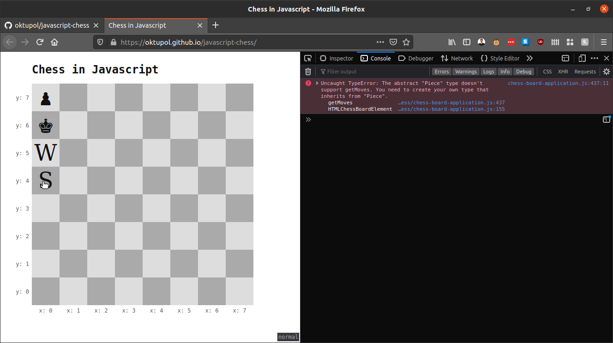
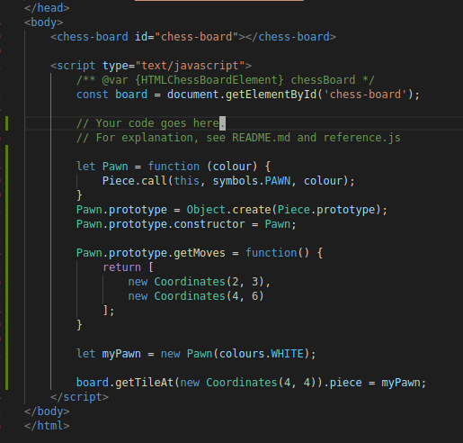
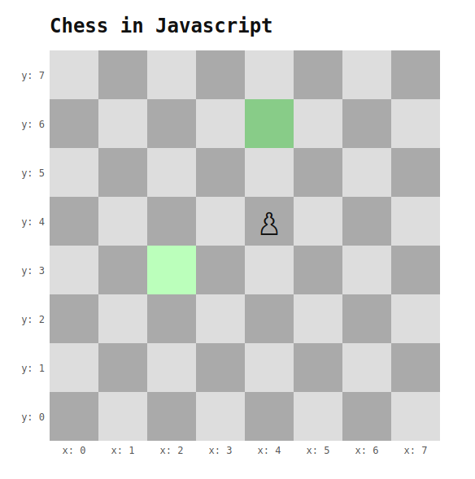
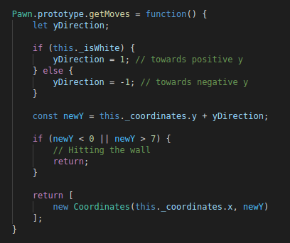

# Chess in Javascript

Try out your prototyping skills using this chessboard! This application serves as a playground for object oriented Javascript programming. Note that this README requires some basic knowledge about javascript prototyping.

## Usage

### Tiles

You may visit the application in action [here](https://oktupol.github.io/javascript-chess/), or clone / download this repository. Upon visiting the `index.html` page, you will find an empty chess board. In the `index.html`, the board instance is already assigned to the constant `board`.

Open the developer console and type following:
```
tile = board.getTileAt(new Coordinates(2, 3))
```
It will return you a `div` element. Hover above the return value to confirm that this is indeed the tile you wanted to see.



### Pieces

Now let's place a piece on the board. The application comes with the `Piece` prototype, a barebone type that represents the basic features of a chess pice. Let's create one.

```
piece = new Piece(symbols.PAWN, colours.BLACK);
```

Now, what happened here? Using the `Piece` constructor, we created an object with the `Piece` prototype. Right now this piece is not yet on the board, therefore we can't see it. Before we place it there, let me explain how the `Piece` constructor works.

The `Piece` constructor takes two arguments. A symbol, which will later be displayed on the chessboard, and a colour. The colour is either `colours.BLACK` or `colours.WHITE` - two values that come with the application. The symbol may be one of three things:

- A pre-defined chess symbol. This application comes with `symbols.PAWN`, `symbols.ROOK`, `symbols.KNIGHT`, `symbols.BISHOP`, `symbols.QUEEN`, `symbols.KING`. These are going to be automatically translated into Unicode chess-piece symbols.
- An object with the keys `[colour.BLACK]` and `[colour.WHITE]`, each key containing a string value. In this case, different strings will be shown on the board depending whether the piece is black or white
- A `SymbolDefinition` object, which can be created with `new SymbolDefinition(symbolForWhite, symbolForBlack)`. The two arguments are strings, of which the one corresponding to the piece's colour is used for display.
- A string. In this case, the string will be used for display.

Let's create a few more pieces:
```
piece2 = new Piece(symbols.KING, colours.BLACK);
piece3 = new Piece(new SymbolDefinition('W', 'B'), colours.WHITE);
piece4 = new Piece('S', colours.WHITE);
```

And now we're going to place them on the board
```
tile1 = board.getTileAt(new Coordinates(0, 7));
tile1.piece = piece;

tile2 = board.getTileAt(new Coordinates(0, 6));
tile2.piece = piece2;

tile3 = board.getTileAt(new Coordinates(0, 5));
tile3.piece = piece3;

tile4 = board.getTileAt(new Coordinates(0, 4));
tile4.piece = piece4;
```



As you see, `piece3` displays a "W" because it's white. You might ask why passing a SymbolDefinition with two symbols, one for black, and one for white, may be necessary. After all, the colour of the piece is defined in the same statement. The basic idea is that later, we're going to create our own chesspiece types, inheriting from `Piece`. And those types will have pre-defined symbols for both colours, so that the constructor only needs the colour.

Go ahead, move them around to different tiles!

```
tile5 = board.getTileAt(new Coordinates(4, 4));
tile5.piece = piece2
```

`piece2` moved away from the left side of the board into its centre.

You might also have noticed that the cursor changes into a pointer when hovering over a piece. Go ahead, and click on one.



An error popped up, and rightly so. The `Piece` type is quite abstract. Javascript doesn't have the keyword `abstract`, but if it did, `Piece` would definitely deserve it. `Piece` doesn't know how to move, and therefore throws an error. We need to create our own implementations of `Piece` in order to move. It's time to get our hands dirty!

### Our first own piece

Let's start with an easy one. Let's implement a pawn. For our purposes, pawns can move one tile in one direction. Upwards, if they're white, and downwards, if they're black. For the purpose of this tutorial, I'm not going to cover capturing rules, en passant rules or the starting move that allows the pawn to move two tiles.

By now, it is recommended to have your own copy of the application locally.

Open up the `index.html` file. You will see is athat it is relatively small. Below the `chess-board` element, there is a `script` element, in which the `board` constant is initialized.

Now, open `reference.js`. It contains an explanation of all types you're going to work with. The most important one, of course, is `Piece`. Keep in mind that this file doesn't contain the actual implementation. Latter is over in `chess-board-application.js`. You may look at it as well, however, it makes heavy use of some advanced javascript features, which, for the purpose of this exercise, you don't have to understand.

Let's look at the `Piece` constructor:

```
let Piece = function (symbol, colour) {
  this.symbol = symbol;
  this.colour = colour;
  
  // some "magic" fields
}
```

Pretty straightforward, isn't it? Now we create our Pawn constructor. Go back to `index.html`, into the `script` element, and type following:

```
let Pawn = function (colour) {
    Piece.call(this, symbols.PAWN, colour);
}
Pawn.prototype = Object.create(Piece.prototype);
Pawn.prototype.constructor = Pawn;
```

Now you see why it's useful to be able to assign an object with different symbols for white and black. When we instantiate a `Pawn`, we no longer have to tell it how it looks like:

```
let myPawn = new Pawn(colours.WHITE);

board.getTileAt(new Coordinates(4, 4)).piece = myPawn;
```

If you click on it, you will still get an error. That's because `getMoves` still comes from the `Piece` prototype. We have to create our own implementation to hide `Pawn`'s implementation. This is called shadowing.

For now, I'm going to return a static result:

```
Pawn.prototype.getMoves = function() {
    return [
        new Coordinates(2, 3),
        new Coordinates(4, 6)
    ];
}
```



If you click on the pawn now, you will see some green tiles



These tiles correspond to the coordinates returned by the `getMoves` function. Click on a green tile now, and see how the pawn jumps over to its new location.

Of course, a pawn that jumps between two locations is neither useful, nor accurate regarding the rules of chess.
Let's complete the logic. First, we're going to determine the direction in which the pawn may move. Let's recap: white pawns move upwards, black pawns move downwards. In terms of coordinates, white pawns move towards positive `y`s, black pawns towards negative `y`s. I'm going to capture this property with a variable called `yDirection`. I'm also making use of the fields `_coordinates`, `_isWhite` and `_isBlack` provided by `Piece`. More info on that can be found in `reference.js`.

```
Pawn.prototype.getMoves = function() {
    let yDirection;

    if (this._isWhite) {
        yDirection = 1; // towards positive y
    } else {
        yDirection = -1; // towards negative y
    }
}
```

Now we have to test whether the pawn would hit the wall if he goes in this direction. For that, we first need to calculate its new `y` value, then check whether it's in the range between 0 and 7. If not, we will cancel the execution of this method and return nothing.

```
const newY = this._coordinates.y + yDirection;

if (newY < 0 || newY > 7) {
    // Hitting the wall
    return;
}
```

At last, we need to return an array with the coordinates the pawn may travel to. We're reusing the current coordinates' `x` value, because it didn't change. Our array is only going to contain one element:

```
return [
    new Coordinates(this._coordinates.x, newY)
];
```



Go ahead, click on the pawn now. It'll move only one tile forward, and always to the one directly in front of it.
Create pawns of both colours and see how they move in different directions!

### Continuing from here

Implement some other chess pieces, or come up with your own pieces. Some challenges that I can think of are:

- A piece type that can only jump into the corners of the board, regardless of where it is
- A piece that can only move, when there is another piece adjacent to it
- A piece that can only move if it jumps over an adjacent piece
- A piece that can only swap places with one other "friend" piece
- A piece that can only move towards the piece on the board, which is the farthest away from itself.
- The chess castling move, where a king moves two to the side, and a rook takes the king's original place
- The chess en-passant move, where a pawn may capture an enemy pawn standing next to it (and not diagonally in front of it), if the enemy pawn just moved two fields forward.
- Disallow moves that would cause the king to be in check. Use the `board.getAllPiecesOfColour` and `piece.getMoves` methods for this.

Also, when implementing the Rook, the Bishop and the Queen, try to make use of the fact that the Queen combines the abilities of the Rook and the Bishop. You can even go one step further and say the King is just like the Queen, but with limited range.

Have fun!
